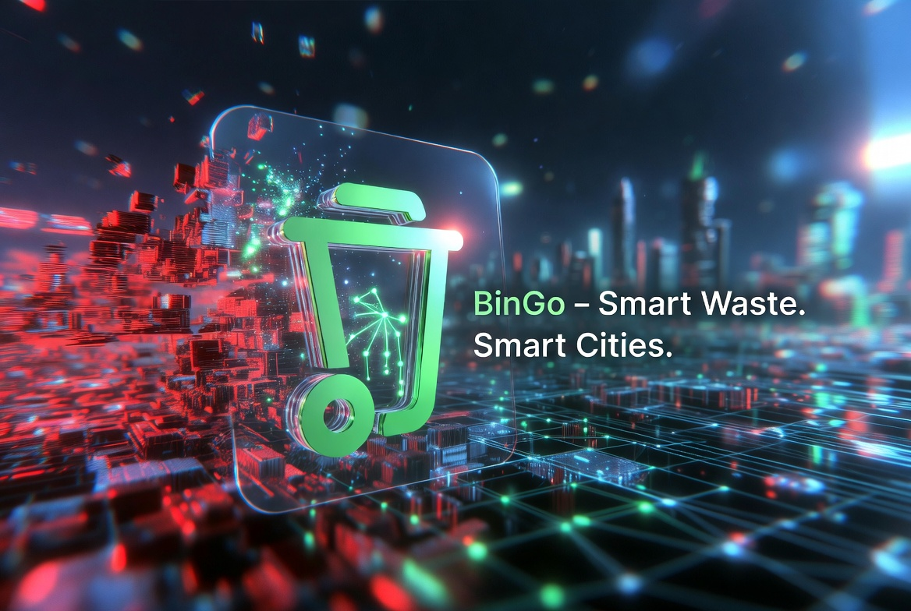
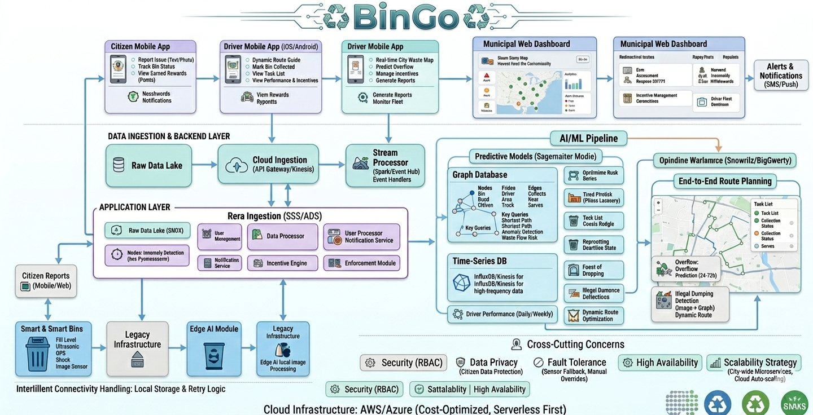
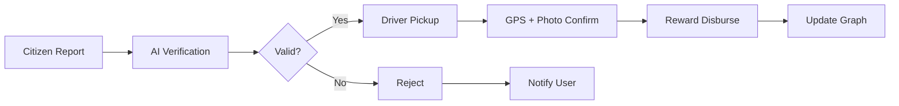

<div align="center">



<h1>🗑️ BinGo — AI-Driven Smart Waste Management Platform</h1>

<p style="color: #2563eb; margin: 15px 0; font-size: 1.1em;">🎯 A scalable, AI-powered smart waste management and circular economy platform designed to solve India's urban solid waste crisis through intelligence, incentives, and enforcement.</p>

<p style="font-size: 1.2em; color: #1e40af; background: linear-gradient(135deg, #dbeafe 0%, #bfdbfe 100%); padding: 20px; border-radius: 12px; max-width: 800px; margin: 20px auto; line-height: 1.6; border-left: 4px solid #2563eb;">
🤖 <b>Predictive AI</b> | 📊 <b>Graph Intelligence</b> | 💰 <b>Incentive System</b> | 🚛 <b>Route Optimization</b>
</p>

<p align="center">
  
  
  
  
  
  
</p>

</div>

---

# 📋 Executive Summary

BinGo is a scalable, AI-powered smart waste management and circular economy platform designed to solve India's urban solid waste crisis through intelligence, incentives, and enforcement. The platform integrates IoT-enabled community bins, graph-based system modeling, predictive AI, optimized collection routing, citizen engagement rewards, driver performance incentives, and automated anti-illegal dumping enforcement.

**Target Cities:** Mid-to-large Indian cities like Meerut (500+ tons/day waste generation)

**Impact Goals:**
- 🎯 Reduce collection costs by **30-40%**
- 🎯 Cut illegal dumping by **50%+**
- 🎯 Achieve **90%+ collection efficiency**
- 🎯 Lower methane emissions significantly

**Alignment:** SDG 11 (Sustainable Cities), SDG 13 (Climate Action), SDG 7 (Clean Energy)

**Business Model:** B2G SaaS + Resource Recovery

**Projected ARR:** ₹5-10 crore within 12-24 months across 5-10 urban zones

---

# 🚨 Problem Statement

India generates approximately **62 million tonnes** of municipal solid waste (MSW) annually, yet only **20-30%** is efficiently collected and processed in urban regions.

### Key Challenges

<div align="center">

| Challenge | Impact | Consequence |
|-----------|--------|-------------|
| **Inefficient Routes** | ~40% fuel wastage | High operational costs |
| **Overflowing Bins** | Widespread illegal dumping | Health hazards & flooding |
| **No Incentives** | Low citizen participation | Poor waste segregation |
| **Fragmented Data** | No predictive intelligence | Reactive operations |
| **Illegal Dumping** | Drains & roadsides polluted | Dengue outbreaks |
| **No Accountability** | Poor driver performance | Missed collections |

</div>

### Economic Impact

**₹15,000 crore** annual loss from healthcare costs, lost productivity, and environmental damage.

### City Context – Meerut

- **500 tons/day** waste generation
- Irregular collection during monsoons
- Dumping hotspots worsen sanitation
- Significant public health risks

---

# 💡 Why BinGo? (Rationale & Objectives)

Existing waste management solutions are **reactive, siloed, and operationally inefficient**. Basic IoT bins lack intelligence, incentives, and enforcement.

### BinGo is Built To:

✅ **Predict** problems before bins overflow  
✅ **Optimize** routes dynamically using real-time data  
✅ **Motivate** citizens and drivers through verified rewards  
✅ **Enforce** accountability with data-backed violation detection  
✅ **Convert** waste into economic value via recycling  

### Core Objectives

<div align="center">

| Objective | Target | Benefit |
|-----------|--------|---------|
| **Cost Reduction** | 30-40% | Lower fuel & operational expenses |
| **Collection Efficiency** | 90%+ | Timely pickups, no overflow |
| **Illegal Dumping** | 50% reduction | Cleaner streets & drains |
| **Financial Sustainability** | Data-driven ops | Self-sustaining municipal system |

</div>

---

# 🎯 Solution Overview

BinGo is an integrated **physical-digital platform** consisting of:

### A. Smart Waste Infrastructure

🗑️ **IoT-Enabled Community Bins** (500-1000L capacity)
- Fill-level sensors
- Weight measurement
- GPS location tracking
- Real-time data transmission

### B. Digital Applications

📱 **Citizen App**
- Report illegal dumping
- Track clean actions
- Earn UPI rewards
- View nearby bins

🚛 **Driver App**
- AI-optimized routes
- Live task prioritization
- Performance bonuses
- GPS tracking

🖥️ **Municipal Dashboard**
- City-wide visibility
- Real-time analytics
- Alert management
- Enforcement tools

### C. Intelligence Core (Graph + AI)

🧠 **Graph Database**
- Models waste flows
- Identifies dependencies
- Detects risk hotspots

🤖 **AI Models**
- Overflow prediction (24-72 hrs)
- Route optimization
- Anomaly detection
- Demand forecasting

### D. Incentive & Enforcement Layer

💰 **UPI-Based Micro-Rewards**
- Verified action rewards
- Instant disbursement
- Transparent tracking

⚖️ **Automated Violation Detection**
- Image recognition
- Graph anomaly detection
- Escalation workflow

---

# ⭐ Key Platform Features (Differentiators)

### 1. 🔮 Predictive Bin Overflow Alerts
Forecasts bin fill levels **24-72 hours** in advance using time-series AI models

### 2. 🗺️ Graph-Based City Waste Map
Visualizes waste flow, dependencies, and bottlenecks across the entire city network

### 3. 🚛 AI Route Optimization
Reduces fuel use and time with **dynamic routing** based on real-time bin status

### 4. 💰 Citizen Reward System
Earn **UPI rewards** for verified reports and proper waste segregation

### 5. 🏆 Driver Performance Incentives
Bonuses for **on-time, high-quality** pickups with GPS verification

### 6. 📸 Illegal Dumping Detection
**Image + graph anomaly** detection with automated escalation

### 7. 🌧️ Monsoon & Event Readiness Mode
**Surge prediction** during rains, festivals, and special events

### 8. ♻️ Recyclables & Compost Tracking
Enables **circular economy** monetization and EPR compliance

### 9. 📊 Real-Time Municipal Dashboard
Zone-wise KPIs, compliance metrics, and performance analytics

### 10. 💳 UPI-Based Instant Transactions
Transparent and auditable **rewards & fines** system

---

## 🧱 System Architecture

<div align="center">
  
</div>

### Layered Architecture

**1. Data Acquisition Layer**
- IoT sensors on bins (fill-level, weight, GPS)
- Citizen and driver app inputs (images, GPS)
- Truck telemetry
- External data (traffic, weather)

**2. Data Ingestion & Storage**
- Real-time streaming (MQTT / Kafka)
- Cloud processing layer
- Graph database for spatial-temporal relationships
- PostgreSQL for transactional data

**3. Intelligence Layer**
- Overflow prediction models (Time-series forecasting)
- Route optimization engine (Reinforcement learning)
- Graph anomaly detection for dumping hotspots
- Incentive verification engine

**4. Application Layer**
- Mobile apps (citizen & driver) - React Native
- Web dashboard for municipal authorities - React
- Admin panel for system management

**5. Security & Integration Layer**
- UPI payment integration
- Role-based access control (RBAC)
- Fraud detection algorithms
- End-to-end encryption

---

## 🔬 Low-Level Design (LLD)

### Graph Data Model

**Nodes:**
- 🗑️ **Bin** (location, capacity, fill-level, last_collection)
- 🚛 **Truck** (capacity, GPS, performance_score, current_route)
- 👤 **User** (citizen/driver, reward_balance, verification_status)
- 🚫 **Hotspot** (dumping_incidents, severity, location)

**Edges:**
- ➡️ **Waste Flow** (bin → truck → processing_facility)
- ⚠️ **Risk Dependency** (overflow propagation between bins)
- 💰 **Incentive Link** (verified_action → reward)
- 🔗 **Route Connection** (bin → bin → truck)

**Key Graph Queries:**
```cypher
// High-risk zone detection
MATCH (b:Bin)-[:RISK_DEPENDENCY*1..3]->(h:Hotspot)
WHERE b.fill_level > 0.8
RETURN b, h

// Route bottleneck identification
MATCH (t:Truck)-[:ASSIGNED_TO]->(b:Bin)
WHERE b.fill_level > 0.9
RETURN t, COUNT(b) as overdue_bins

// Dumping hotspot clustering
MATCH (h:Hotspot)-[:NEAR*1..2]-(h2:Hotspot)
WHERE h.severity > 7
RETURN h, h2
```

### AI & Analytics

**Prediction Models:**
- Time-series forecasting (LSTM/Prophet) for bin overflow
- Demand prediction for monsoon/festival seasons

**Optimization Algorithms:**
- Reinforcement learning for dynamic routing
- Constrained optimization for truck allocation

**Anomaly Detection:**
- Graph-based pattern deviation detection
- Image classification for illegal dumping

### Verification Workflow



**Steps:**
1. Citizen submits report with **image + GPS**
2. AI verifies **authenticity and location**
3. Driver confirms pickup with **GPS and photo**
4. Reward **auto-disbursed via UPI**
5. Violations **escalated** to municipal authorities

---

## 💻 Technology Stack

<div align="center">

<table>
<thead>
<tr>
<th>🖥️ Technology</th>
<th>⚙️ Description</th>
<th>🎯 Purpose</th>
</tr>
</thead>
<tbody>
<tr>
<td></td>
<td>Mobile framework</td>
<td>Cross-platform citizen & driver apps</td>
</tr>
<tr>
<td></td>
<td>Web framework</td>
<td>Municipal dashboard & admin panel</td>
</tr>
<tr>
<td></td>
<td>Backend framework</td>
<td>REST API with async support</td>
</tr>
<tr>
<td></td>
<td>Graph database</td>
<td>Waste flow modeling & analytics</td>
</tr>
<tr>
<td></td>
<td>Relational DB</td>
<td>Transactional data storage</td>
</tr>
<tr>
<td></td>
<td>ML framework</td>
<td>AI models for prediction & optimization</td>
</tr>
<tr>
<td></td>
<td>IoT hardware</td>
<td>Smart bin sensors</td>
</tr>
<tr>
<td></td>
<td>IoT protocol</td>
<td>Real-time sensor data streaming</td>
</tr>
<tr>
<td></td>
<td>Cloud platform</td>
<td>Hosting & scalability</td>
</tr>
<tr>
<td></td>
<td>Containerization</td>
<td>Easy deployment</td>
</tr>
</tbody>
</table>

</div>

---

## 💼 Business Model & Revenue Streams

### Revenue Sources

**1. Municipal Contracts** 💰
- Monthly SaaS subscription
- Per-ton tipping fees
- Performance-based incentives

**2. Resource Recovery** ♻️
- Sale of recyclables (plastic, metal, paper)
- Compost production and sales
- RDF (Refuse-Derived Fuel) generation

**3. Data & Compliance Services** 📊
- EPR (Extended Producer Responsibility) reporting
- Waste analytics for industries
- Compliance certification

**4. Sponsored Incentives** 🎁
- Brand-funded recycling rewards
- CSR partnerships
- Green marketing campaigns

### Financial Projections

| Metric | Year 1 | Year 2 | Year 3 |
|--------|--------|--------|--------|
| **Cities Covered** | 2-3 | 5-7 | 10-15 |
| **Revenue (₹ Cr)** | 2-3 | 5-10 | 15-25 |
| **EBITDA Margin** | 10-15% | 18-22% | 22-25% |
| **Waste Processed (tons/day)** | 500-800 | 1500-2500 | 3000-5000 |

**Target EBITDA Margin:** 18-25%

---

## 🗓️ Implementation Roadmap

### Phase 1 – Hackathon MVP (72 Hours) ✅

**Deliverables:**
- Mock city dataset with 100+ bins
- Graph visualization dashboard
- AI prediction demo (overflow forecasting)
- Incentive simulation system
- Basic mobile app mockups

**Tech Stack:**
- Python + FastAPI
- Neo4j graph database
- React dashboard
- Mock IoT data generator

---

### Phase 2 – Pilot Deployment (3-6 Months) 🚀

**Target:** One municipal zone (50-100 bins)

**Activities:**
- Deploy 50 IoT-enabled bins
- Onboard 500-1000 citizens
- Partner with 10-15 waste collection trucks
- Municipal partnership agreement
- Real-world data collection

**Success Metrics:**
- 80%+ collection efficiency
- 30% cost reduction
- 100+ verified citizen reports
- 20% illegal dumping reduction

---

### Phase 3 – Scale & Expansion (Year 1-3) 📈

**Target:** 5-10 urban zones across multiple cities

**Activities:**
- Expand to 500-1000 bins per city
- State government partnerships
- National rollout strategy
- Advanced AI model training
- Resource recovery facility integration

**Success Metrics:**
- ₹5-10 crore ARR
- 90%+ collection efficiency
- 50%+ illegal dumping reduction
- 10,000+ active users

---

## 📊 Impact Metrics

### Environmental Impact

- 🌱 **30-40% reduction** in fuel consumption
- 🌱 **50%+ reduction** in illegal dumping
- 🌱 **Significant decrease** in methane emissions
- 🌱 **Increased recycling** rates by 40%

### Social Impact

- 👥 **Improved public health** (reduced dengue, flooding)
- 👥 **Citizen engagement** through rewards
- 👥 **Driver livelihood** improvement via incentives
- 👥 **Cleaner neighborhoods** and streets

### Economic Impact

- 💰 **₹15,000 crore** potential savings nationally
- 💰 **30-40% operational cost** reduction for municipalities
- 💰 **Revenue generation** from recyclables
- 💰 **Job creation** in waste management sector

---

## 🏆 Competitive Advantages

✅ **End-to-End Solution** – Hardware + Software + Intelligence  
✅ **Graph-Based Intelligence** – Unique waste flow modeling  
✅ **Behavioral Economics** – Incentive-driven citizen participation  
✅ **Predictive AI** – Proactive vs reactive operations  
✅ **Circular Economy** – Resource recovery monetization  
✅ **Scalable Architecture** – Cloud-native, modular design  
✅ **Government Alignment** – Swachh Bharat Mission compatible  

---

## 🎯 Target Market

### Primary Market

**Tier 1 & 2 Cities:**
- Delhi NCR, Mumbai, Bangalore, Hyderabad
- Pune, Ahmedabad, Jaipur, Lucknow
- Meerut, Kanpur, Indore, Bhopal

**Market Size:**
- 50+ cities with 500+ tons/day waste
- ₹10,000+ crore addressable market
- 100,000+ waste collection vehicles

### Secondary Market

**Tier 3 Cities & Smart Cities Mission:**
- 100+ smart cities under development
- Growing urban waste challenges
- Government funding availability

---

## 🤝 Partnerships & Stakeholders

### Key Partners

🏛️ **Municipal Corporations** – Primary customers  
🏭 **Waste Processing Facilities** – Resource recovery  
🏢 **Corporate CSR Programs** – Funding & sponsorships  
🎓 **Academic Institutions** – Research & validation  
🚛 **Logistics Companies** – Fleet management  
💳 **Payment Gateways** – UPI integration  

### Stakeholder Benefits

| Stakeholder | Benefit |
|-------------|---------|
| **Citizens** | Cleaner city, rewards, transparency |
| **Drivers** | Performance bonuses, optimized routes |
| **Municipality** | Cost savings, data-driven decisions |
| **Environment** | Reduced emissions, better recycling |
| **Investors** | Scalable B2G SaaS model, impact |

---

## 📞 Contact & Team

<div align="center">

> 💬 *Building India's smartest waste management platform*  
> Transforming waste from problem to opportunity

<br/>

**🏆 Graph-E-Thon Track 2: Resilient Cities & Energy**

**📧 Contact:** team@bingo.in  
**🌐 Website:** www.bingo.in  
**📱 Demo:** [Schedule a demo](mailto:team@bingo.in)

</div>

---

<div align="center">

## 📄 License

This project is developed for Graph-E-Thon 2026 - Track 2: Resilient Cities & Energy

---

## 🙏 Acknowledgments

- **Graph-E-Thon Organizers** – For the opportunity
- **Municipal Corporations** – For problem insights
- **Waste Management Workers** – For ground reality
- **Citizens** – For feedback and participation

---

<div align="center">

## 🚀 Built for Sustainable & Smart Cities

**BinGo** — AI-Driven Smart Waste Management Platform

*Making cities cleaner, greener, and smarter through intelligence and incentives*

---

**© 2026 BinGo | Graph-E-Thon Hackathon Project**

*Aligned with SDG 11, SDG 13, and SDG 7*


---

### 🔥 Ready to Transform Waste Management?

**Join the BinGo Revolution:**

1. 📖 Read the [Technical Documentation](docs/TECHNICAL.md)
2. 🚀 Check the [Implementation Guide](docs/IMPLEMENTATION.md)
3. 📊 View [Demo Dashboard](https://demo.bingo.in)
4. 💡 Contribute to making cities cleaner!

**Questions?** Reach out to us at team@bingo.in

---

**Let's make India's cities cleaner, one bin at a time!** 🗑️♻️🌱

*BinGo - Intelligence meets Incentives for Sustainable Waste Management* 🚀

</div>
