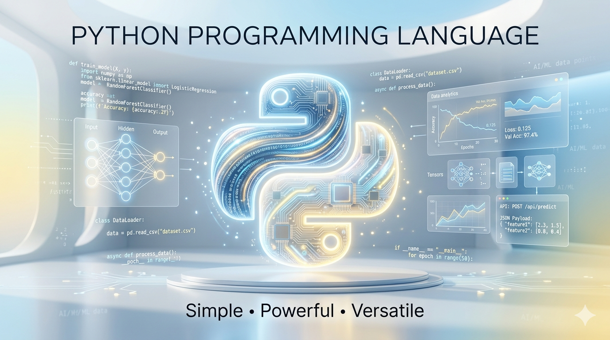

<div align="center">



<h1>🐍 Python Programming — From Basics to Real-World Applications</h1>

<p><b>Code • Logic • Automation • AI</b></p>

<p><i>Master Python with deep understanding of logic, automation, and real-world problem solving.</i></p>

<br/>

<p>
  
  
  
  
  
  
</p>

</div>

---

## 🚀 Introduction

**Python** is a high-level, interpreted, general-purpose programming language created by Guido van Rossum in 1991. It is consistently ranked as the **#1 most popular programming language** in the world — and for good reason.

**Why learn Python?**

- **Readable syntax** — code reads almost like plain English, making it ideal for beginners
- **Versatile powerhouse** — from web apps to AI models, Python does it all
- **Massive ecosystem** — 400,000+ packages on PyPI covering every domain imaginable
- **Industry standard** — used by Google, Netflix, NASA, Instagram, and every major AI lab

**Real-world applications:**

- 🧠 **AI & Machine Learning** — TensorFlow, PyTorch, Scikit-learn
- 🌐 **Web Development** — Django, Flask, FastAPI
- 📊 **Data Science** — Pandas, NumPy, Matplotlib
- ⚙️ **Automation & Scripting** — task automation, web scraping, DevOps
- 🔬 **Scientific Computing** — research, simulations, data analysis

---

## 🎯 Learning Goals

<div align="center">
<table>
  <tr>
    <td align="center" width="20%">
      <br/><br/>
      Syntax, variables, data types, operators — rock solid
    </td>
    <td align="center" width="20%">
      <br/><br/>
      Logic-first thinking with real coding challenges
    </td>
    <td align="center" width="20%">
      <br/><br/>
      Scripts that save hours — files, web, APIs, tasks
    </td>
    <td align="center" width="20%">
      <br/><br/>
      Build things that work — not just toy examples
    </td>
    <td align="center" width="20%">
      <br/><br/>
      NumPy, Pandas, Scikit-learn, and beyond
    </td>
  </tr>
</table>
</div>

---

## 📚 Complete Roadmap

<div align="center">
<table>
  <tr>
    <td align="center"></td>
    <td><b>Syntax, Variables, Data Types, I/O, Operators</b></td>
    <td align="center">✅ Completed</td>
  </tr>
  <tr>
    <td align="center"></td>
    <td><b>Literals, slicing, methods, escape sequences, f-strings</b></td>
    <td align="center">✅ Completed</td>
  </tr>
  <tr>
    <td align="center"></td>
    <td><b>if / elif / else, match-case, ternary expressions</b></td>
    <td align="center">🔜 Up Next</td>
  </tr>
  <tr>
    <td align="center"></td>
    <td><b>for, while, break, continue, pass, comprehensions</b></td>
    <td align="center">🔜 Coming Soon</td>
  </tr>
  <tr>
    <td align="center"></td>
    <td><b>def, args/kwargs, lambda, scope, recursion, decorators</b></td>
    <td align="center">🔜 Coming Soon</td>
  </tr>
  <tr>
    <td align="center"></td>
    <td><b>List, Tuple, Set, Dictionary — operations & methods</b></td>
    <td align="center">🔜 Coming Soon</td>
  </tr>
  <tr>
    <td align="center"></td>
    <td><b>open, read, write, with statement, CSV, JSON</b></td>
    <td align="center">🔜 Coming Soon</td>
  </tr>
  <tr>
    <td align="center"></td>
    <td><b>Classes, objects, inheritance, polymorphism, dunder methods</b></td>
    <td align="center">🔴 Critical</td>
  </tr>
  <tr>
    <td align="center"></td>
    <td><b>import, pip, virtual environments, custom modules</b></td>
    <td align="center">🔴 Ecosystem</td>
  </tr>
  <tr>
    <td align="center"></td>
    <td><b>try/except/finally, custom exceptions, error types</b></td>
    <td align="center">🔴 Robustness</td>
  </tr>
  <tr>
    <td align="center"></td>
    <td><b>NumPy, Pandas, Matplotlib, Requests, OS, datetime</b></td>
    <td align="center">🔴 Power Tools</td>
  </tr>
  <tr>
    <td align="center"></td>
    <td><b>Flask/Django basics, Scikit-learn, Selenium, APIs</b></td>
    <td align="center">🔴 Mastery</td>
  </tr>
</table>
</div>

---

## 📂 Folder Structure

```
PythonPathway/
├── assets/
│   └── Python.png
├── Chapter_01/                  ← Intro, Comments, Modules
│   ├── 01_one.py                   Hello World & single/multi-line comments
│   ├── 02_maths.py                 User-defined module (add, subtract, multiply)
│   └── 03_main.py                  Importing built-in, custom & external modules
├── Chapter_02/                  ← Variables, Operators & Data Types
│   ├── 01_varibles.py              Variables & data types (int, float, str, bool, None)
│   ├── 02_rules.py                 Naming rules & conventions
│   ├── 03_operators.py             Arithmetic, assignment, comparison, logical operators
│   ├── 04_type.py                  type() function — checking data types
│   ├── 05_typecasting.py           int(), float(), str() type conversions
│   └── 06_input.py                 input() & user interaction
├── Chapter_03/                  ← Strings
│   ├── 01_strings.py               String literals — single, double, triple quotes
│   ├── 02_slicing.py               Positive, negative & step slicing
│   ├── 03_functions.py             String methods — len, find, replace, capitalize, count
│   └── 04_escape.py                Escape sequences — \n, \t, \\, \'
├── Practice_01/                 ← Practice: Basics & Modules
│   ├── P1.py                       Multi-line print — poem using triple quotes
│   ├── P2.py                       Text-to-Speech using pyttsx3
│   └── P3.py                       List directory contents using os module
├── Practice_02/                 ← Practice: Variables & Operators
│   ├── P1.py                       Basic arithmetic (addition)
│   ├── P2.py                       Modulo operator
│   ├── P3.py                       input() & type checking
│   ├── P4.py                       Comparison operator (>)
│   ├── P5.py                       Average of two numbers via input
│   └── P6.py                       Input & exponentiation (**)
├── Practice_03/                 ← Practice: Strings
│   ├── P1.py                       input() + f-string greeting
│   ├── P2.py                       f-string with \n — formatted letter
│   ├── P3.py                       str.find() — locate substring
│   ├── P4.py                       str.replace() — fix extra spaces
│   └── P5.py                       Escape sequences in print
├── docs/
│   └── Python_Handbook.pdf      ← Reference handbook (tracked via Git LFS)
├── .gitattributes
├── .gitignore
├── LICENSE
└── README.md
```

> 📁 Chapters and Practice sets are added progressively as each module is completed — following the roadmap above.

---

## 💡 Concepts Covered

<table>
  <tr>
    <td width="50%" valign="top">

**Core Concepts**
- ✅ Variables & Data Types (`int`, `float`, `str`, `bool`, `NoneType`)
- ✅ Operators (arithmetic, assignment, comparison, logical)
- ✅ type() function & typecasting (`int()`, `float()`, `str()`)
- ✅ User input with `input()`
- ✅ Modules — built-in (`math`, `os`), custom, external (`numpy`)
- ✅ Comments — single-line & multi-line

**Strings**
- ✅ String literals — single, double, triple quotes
- ✅ Slicing — positive, negative, step
- ✅ String methods — `len`, `find`, `replace`, `capitalize`, `count`, `endswith`
- ✅ Escape sequences — `\n`, `\t`, `\\`, `\'`
- ✅ f-strings & string formatting

    </td>
    <td width="50%" valign="top">

**OOP Concepts** *(Coming Soon)*
- 🔴 Classes & Objects — blueprints and instances
- 🔴 Inheritance & Polymorphism
- 🔴 Encapsulation & Abstraction
- 🔴 Dunder/Magic Methods (`__init__`, `__str__`, `__repr__`)
- 🔴 Decorators & Properties

**Libraries & Ecosystem**
- ✅ `os` — directory listing
- ✅ `math` — built-in math functions
- ✅ `numpy` — external array module (intro)
- ✅ `pyttsx3` — text-to-speech (practice)

**Advanced Concepts** *(Coming Soon)*
- 🔴 Generators & Iterators
- 🔴 Context Managers (`with`)
- 🔴 Multithreading & Async basics
- 🔴 Type Hints & Dataclasses

    </td>
  </tr>
</table>

> 🔴 **OOP and Generators** deserve special attention — they are what separate a Python beginner from a Python developer. Every concept here is explained with logic, code, and real-world context.

---

## 🐍 Python Strengths

<div align="center">
<table>
  <tr>
    <td align="center" width="33%">
      <b>✍️ Simple Syntax</b><br/><br/>
      Reads like English. Write less, do more. No semicolons, no braces — just clean logic.
    </td>
    <td align="center" width="33%">
      <b>📦 Huge Ecosystem</b><br/><br/>
      400,000+ packages on PyPI. Whatever you need — it already exists.
    </td>
    <td align="center" width="33%">
      <b>⚡ Fast Development</b><br/><br/>
      Prototype in hours, not days. Python's speed of development is unmatched.
    </td>
  </tr>
</table>
</div>

---

## 📊 Libraries at a Glance

<div align="center">
<table>
  <tr>
    <td align="center"></td>
    <td>Numerical computing, arrays, linear algebra, broadcasting</td>
  </tr>
  <tr>
    <td align="center"></td>
    <td>DataFrames, data cleaning, CSV/JSON processing, analysis</td>
  </tr>
  <tr>
    <td align="center"></td>
    <td>Data visualization — charts, plots, graphs, dashboards</td>
  </tr>
  <tr>
    <td align="center"></td>
    <td>HTTP requests, REST APIs, web scraping foundation</td>
  </tr>
</table>
</div>

---

## 🤖 AI / ML Ecosystem

<div align="center">
<table>
  <tr>
    <td align="center"></td>
    <td>Classical ML — classification, regression, clustering, pipelines</td>
  </tr>
  <tr>
    <td align="center"></td>
    <td>Deep learning, neural networks, production ML at scale</td>
  </tr>
  <tr>
    <td align="center"></td>
    <td>Research-grade deep learning, dynamic computation graphs</td>
  </tr>
</table>
</div>

---

## 🌐 Real-World Applications

<div align="center">
<table>
  <tr>
    <td align="center" width="25%">
      <b>🌐 Web Development</b><br/><br/>
      Django & Flask for full-stack apps. FastAPI for blazing-fast REST APIs.
    </td>
    <td align="center" width="25%">
      <b>⚙️ Automation</b><br/><br/>
      Automate repetitive tasks — file ops, emails, web scraping, scheduling.
    </td>
    <td align="center" width="25%">
      <b>📊 Data Analysis</b><br/><br/>
      Clean, transform, and visualize data with Pandas and Matplotlib.
    </td>
    <td align="center" width="25%">
      <b>🧠 AI / ML Projects</b><br/><br/>
      Build models that predict, classify, and generate — from scratch.
    </td>
  </tr>
</table>
</div>

---

## 🧠 Code + Logic Approach

<div align="center">

Every concept follows a strict 5-step learning pattern — no shortcuts.

<br/>


&nbsp;→&nbsp;

&nbsp;→&nbsp;

&nbsp;→&nbsp;

&nbsp;→&nbsp;


<br/><br/>

<table>
  <tr>
    <td align="center" width="20%"><b>📖 Concept</b></td>
    <td align="center" width="20%"><b>🧠 Logic</b></td>
    <td align="center" width="20%"><b>💻 Code</b></td>
    <td align="center" width="20%"><b>⚠️ Edge Cases</b></td>
    <td align="center" width="20%"><b>✅ Best Practices</b></td>
  </tr>
  <tr>
    <td align="center">Understand <i>what</i> it is and <i>why</i> it exists</td>
    <td align="center">Mental model — think before you type</td>
    <td align="center">Clean, Pythonic, well-commented code</td>
    <td align="center">None values, empty inputs, type errors</td>
    <td align="center">PEP 8, readability, Pythonic idioms</td>
  </tr>
</table>

</div>

---

## ⚙️ Setup & Run Code

**Prerequisites:** Python 3.10+ installed on your system.

```bash
# Install Python (macOS via Homebrew)
brew install python

# Install Python (Ubuntu/Debian)
sudo apt install python3

# Verify installation
python3 --version
```

**Run any program:**

```bash
# macOS / Linux
python3 program.py

# Windows
python program.py
```

**Virtual environment setup (recommended):**

```bash
# Create virtual environment
python3 -m venv venv

# Activate (macOS/Linux)
source venv/bin/activate

# Activate (Windows)
venv\Scripts\activate

# Install dependencies
pip install -r requirements.txt
```

**Example — Hello World:**

```python
# hello_world.py
print("Hello, Python World!")
```

```bash
python3 hello_world.py
# Output: Hello, Python World!
```

---

## 📊 Progress Tracker

*Fork this repo and check off topics as you complete them.*

<table>
  <tr>
    <td valign="top" width="50%">

**📦 Basics** ✅
- [x] Hello World & print()
- [x] Comments — single-line & multi-line
- [x] Variables & Data Types
- [x] Operators — arithmetic, assignment, comparison, logical
- [x] type() function
- [x] Type Casting — int(), float(), str()
- [x] input() & user interaction
- [x] Modules — built-in, custom, external

**📝 Strings** ✅
- [x] String literals — single, double, triple quotes
- [x] Slicing — positive, negative, step
- [x] String methods — len, find, replace, capitalize, count
- [x] Escape sequences — \n, \t, \\, \'
- [x] f-strings & string formatting

**🔀 Control Flow** *(Up Next)*
- [ ] if / elif / else
- [ ] match-case (Python 3.10+)
- [ ] Ternary expressions

**🔁 Loops**
- [ ] for loop & range()
- [ ] while loop
- [ ] break, continue, pass
- [ ] List / Dict / Set comprehensions

**🧩 Functions**
- [ ] def & return
- [ ] *args & **kwargs
- [ ] Lambda functions
- [ ] Recursion
- [ ] Decorators

**📂 File Handling**
- [ ] open / read / write
- [ ] with statement
- [ ] CSV & JSON handling

    </td>
    <td valign="top" width="50%">

**🗂️ Data Structures**
- [ ] Lists — methods & slicing
- [ ] Tuples — immutability & unpacking
- [ ] Sets — operations & uniqueness
- [ ] Dictionaries — CRUD & nesting
- [ ] Stack & Queue using collections

**🔴 OOP**
- [ ] Classes & Objects
- [ ] `__init__` & instance methods
- [ ] Inheritance & super()
- [ ] Polymorphism & method overriding
- [ ] Encapsulation (private/protected)
- [ ] Dunder methods
- [ ] Dataclasses

**🔴 Advanced Python**
- [ ] Generators & yield
- [ ] Iterators & itertools
- [ ] Context managers
- [ ] Type hints
- [ ] Async / await basics

**📦 Libraries**
- [ ] NumPy — arrays & operations
- [ ] Pandas — DataFrames & analysis
- [ ] Matplotlib — plotting & charts
- [ ] Requests — HTTP & APIs

**🚀 Projects**
- [ ] Automation script
- [ ] Data analysis project
- [ ] Web scraper
- [ ] REST API (FastAPI/Flask)
- [ ] ML model (Scikit-learn)

    </td>
  </tr>
</table>

---

## 🏆 Why This Repo is Different

<div align="center">

| ✅ Feature | 💡 What It Means |
|-----------|-----------------|
| **Logic-First** | Every concept starts with *why*, not just *how* |
| **Pythonic Code** | Clean, idiomatic Python — not just code that works |
| **Beginner Friendly** | Zero assumed knowledge — starts from absolute scratch |
| **Interview Focused** | Patterns & problems from real tech interviews |
| **Real-World Projects** | Build things that actually solve problems |
| **Edge Cases Covered** | Real-world pitfalls, not just happy-path examples |
| **Structured Roadmap** | Clear progression — no confusion, no gaps |

</div>

---

## 🤝 Contribution

Contributions are welcome! If you want to add examples, fix bugs, or improve explanations:

1. Fork the repository
2. Create a new branch — `git checkout -b feature/your-topic`
3. Add your code with proper comments and logic explanation
4. Commit — `git commit -m "Add: topic name"`
5. Push — `git push origin feature/your-topic`
6. Open a Pull Request

**Contribution Guidelines:**
- Follow the existing folder structure
- Every `.py` file should have a brief comment block explaining the concept
- Code must follow **PEP 8** style guidelines
- Keep it beginner-friendly — explain, don't just code

---

## 📞 Contact & Support

<div align="center">

> 💬 *Have questions, suggestions, or want to collaborate? Reach out!*

<br/>

**👤 Abhishek Giri** — Author & Maintainer

<a href="https://linkedin.com/in/abhishekgiri04">
  
</a>
&nbsp;
<a href="https://github.com/abhishekgiri04">
  
</a>
&nbsp;
<a href="mailto:abhishekgiri.dev@gmail.com">
  
</a>

</div>

---

<div align="center">

## 📄 License

This project is licensed under the **MIT License** — free to use, share, and modify.
See the [LICENSE](LICENSE) file for full details. &nbsp;|&nbsp; Copyright © 2026 [Abhishek Giri](https://github.com/abhishekgiri04)

</div>

---

<div align="center">

**🐍 Built for learners who want to understand Python, not just write it.**

*From your first `print()` to building AI models and automation scripts — this is your complete Python journey.*

<br/>


</div>
